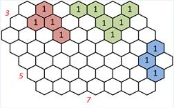
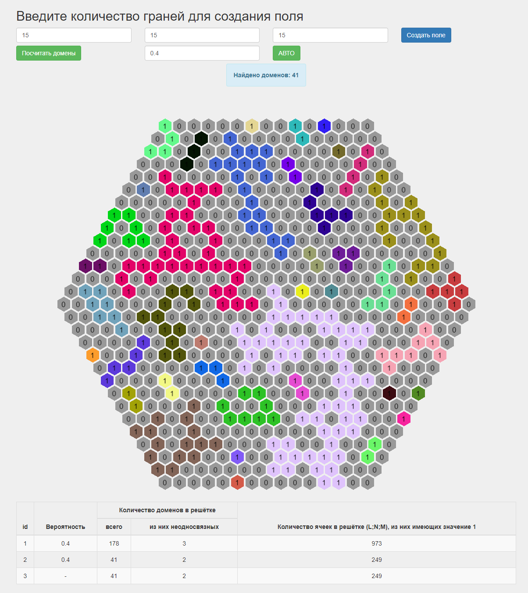

# Поиск неодносвязных доменов в графе

### Задание 

Реализовать интерфейс и логику средствами JavaScript, HTML, CSS (возможно использование фреймворков) по следующим требованиям - необходимо посчитать количество доменов в гексагональной решётке.

Ячейкам решётки может быть присвоено значение 0 или 1. Если 2 ячейки, имеющие одинаковое значение, имеют общую грань, то они входят в один домен.

В решётке, изображённой на рисунке можно определить 3 различных домена, отображённых на рисунке цветами. Подразумевается, что бесцветным ячейкам присвоено значение 0.

 

Предложить пользователю ввод размера односвязной гексагональной области (L, N, M<=30 - три поля ввода с валидацией, на примере L=3, M=5, N=7). После ввода размера отобразить (по отдельной кнопке) на странице пустую гексагональную решётку заданного размера с возможностью ручного ввода значений в ячейки (изменение 0\1 и наоборот щелчком мыши на ячейке).

Программа должна определять количество доменов в заданной решётке, ячейки которых имеют значение 1, (кнопка «Посчитать домены») и выделить цветом ячейки, входящие в домен. Цвета разных доменов должны отличаться. Предусмотреть поле для вывода количества доменов.

Также реализовать автоматическое заполнение решётки по отдельной кнопке «АВТО» значениями 0 или 1 с предварительным указанием вероятности использования единицы (вероятность от 0,01 до 0,99) в отдельном поле ввода с валидацией. По нажатию кнопки «АВТО» также следует рассчитывать количество доменов и раскрашивать их.

После каждого автоматического заполнения и расчета количества доменов в полученной решётке добавлять строку в таблице (внизу страницы) следующего вида:

<table>
    <thead>
    </thead>
    <tbody>
        <tr>
            <td rowspan=2>Вероятность</td>
            <td colspan="2">Количество доменов в решётке</td>
            <td rowspan=2>Количество ячеек в решётке (L;N;M), из них имеющих значение 1</td>
        </tr>
        <tr>
            <td>всего</td>
            <td>Из них неодносвязных</td>
        </tr>
        <tr>
            <td>&nbsp;</td>
            <td>&nbsp;</td>
            <td>&nbsp;</td>
            <td>&nbsp;</td>
        </tr>
        <tr>
            <td>&nbsp;</td>
            <td>&nbsp;</td>
            <td>&nbsp;</td>
            <td>&nbsp;</td>
        </tr>
    </tbody>
</table>

Ограничить количество строк результата в таблице значением 10. Т.е. при попытке вставить 11-ую строку стирается строка 1, происходит сдвиг строк вверх, данные записываются в последнюю строку.

### Решение

Решение написано на JS с использованием [PixiJS](http://www.pixijs.com) для ренедера на WebGL.

#### Пример работы решения

Где первые поля ввода характеристики сторон фигуры, а последнее поле вероятность заполнения 0 или 1 при нажатии на кнопку "Авто".

Домен это группа ячеек объединенных цветом.

Не односвязный домен это группа ячеек объединенных цветом и имеющих внутри домена один или более доменов отличных от цвета домена, например розовый.

Посмотреть решение можно по ссылке [GitHub Pages](https://tihon-ustinov.github.io/graph-hexagon-domains/)
